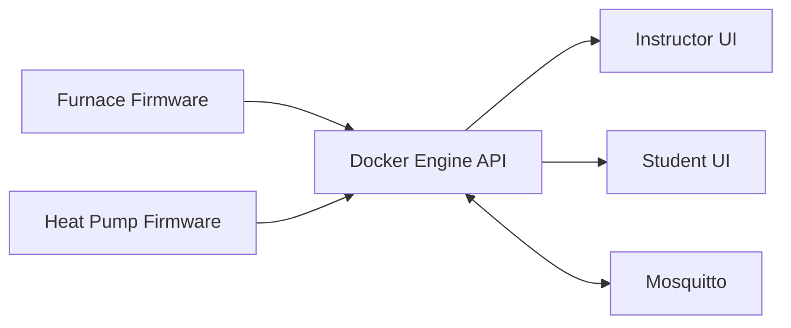

# HVAC Trainer Ver2.0

Integrated repository for the Vesta HVAC trainer platform, combining trainer firmware, local engine services, web interfaces, and supporting documentation in one workspace.

## Overview

This repository supports two primary trainer targets:

- AC + gas furnace trainer
- Heat-pump trainer

The platform is designed to keep hardware behavior, simulation logic, and instructor/student tooling aligned during development and field updates.

## Repository Layout

```text
HVAC Trainer Ver2.0/
|- platform/
|  |- docker-engine/
|  |  |- backend/               # FastAPI engine and simulation bridge
|  |  |- frontend/              # Nginx/static frontend container assets
|  |  |- mosquitto/             # MQTT broker config
|  |  |- web/                   # Instructor/student web pages
|  |  \- docker-compose.yml
|- trainers/
|  |- ac-gas-furnace/
|  |  \- docs/
|  |- heat-pump/
|  |  \- docs/
|  \- unified-master/
|     \- firmware/              # Unified PlatformIO project (ESP32-S3)
|- apps/
|  \- vesta-core-app/
|- docs/
\- tools/
```

## Architecture Summary



## Prerequisites

- Docker Desktop (or Docker Engine with Compose plugin)
- Python 3.11+ for local backend development
- PlatformIO CLI or VS Code PlatformIO extension
- ESP32-S3 board and USB connection for firmware upload

## Quick Start

### Start engine stack

```bash
cd "platform/docker-engine"
docker compose up -d --build
```

### Verify API

```bash
curl http://localhost:8000/api/status
```

## Firmware Workflows

The repository now uses a single unified firmware project for both hardware profiles.

```bash
cd "trainers/unified-master/firmware"
pio run -e usb
```

Use the guarded flash scripts in [tools](e:/Randy/HVAC%20Trainer%20Ver2.0/tools) for all uploads so the correct trainer number, hostname, and target profile are stamped into the firmware.

## Operational Notes

- Trainer telemetry and call states are consumed by the engine from edge heartbeats.
- Heat-pump thermostat call polling is designed to keep telemetry active even when relay boards are unavailable.
- HPS/LPS status can reflect physical pressure trips and explicit fault simulation flags.

## Development Practices

- Keep shared runtime logic in the unified firmware and retain per-trainer docs for hardware-specific notes.
- Update documentation when behavior, wiring assumptions, or API payloads change.
- Validate firmware upload and API visibility together as part of every hardware-facing change.

## Troubleshooting

- If a board uploads but does not report, check edge discovery and engine endpoint settings.
- If API is up but no trainer is selected, inspect `GET /api/edges` and heartbeat freshness.
- If thermostat calls appear wrong, validate call pins, debounce behavior, and relay board presence.

## License

Proprietary project for Mitchell Media Vesta trainer platforms unless otherwise specified.
