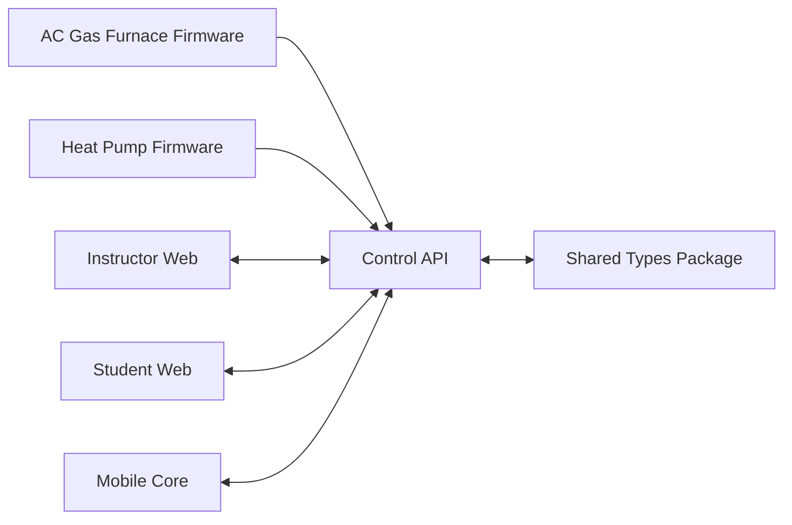

# HVAC Next Gen Monorepo


Integrated monorepo for HVAC training systems, designed to support instructor tools, student lab interfaces, mobile runtime integration, backend control services, and hardware firmware in one versioned codebase.

## Table of Contents

- [Overview](#overview)
- [Technology Stack](#technology-stack)
- [Repository Structure](#repository-structure)
- [System Architecture](#system-architecture)
- [Prerequisites](#prerequisites)
- [Getting Started](#getting-started)
- [Workspace Scripts](#workspace-scripts)
- [Service Endpoints](#service-endpoints)
- [Firmware Workflow](#firmware-workflow)
- [CI Pipeline](#ci-pipeline)
- [Screenshots](#screenshots)
- [Contributing](#contributing)
- [Development Conventions](#development-conventions)
- [Current Status](#current-status)
- [License](#license)

## Overview

This repository provides a unified development model for simulation and physical trainer workflows:

- Instructor Console for scenario control and monitoring.
- Student Interface for guided labs and diagnostics.
- Control API for telemetry, state management, and orchestration.
- Shared type contracts used across frontend and backend services.
- Trainer firmware projects for hardware-level control and IO behavior.

The goal is to keep protocol changes, UI updates, API behavior, and firmware evolution synchronized through a single release process.

## Technology Stack

- Monorepo tooling: Turborepo + pnpm workspaces
- Frontend apps: React + Vite + TypeScript-ready structure
- Backend service: Node.js + Fastify + TypeScript
- Embedded firmware: PlatformIO (ESP32)
- Local orchestration: Docker Compose
- CI: GitHub Actions

## Repository Structure

```text
hvac-next-gen/
  .github/workflows/        # CI pipeline definitions
  apps/
    instructor-web/         # Instructor-facing web app
    student-web/            # Student-facing web app
    mobile-core/            # Mobile shell integration area (Capacitor target)
  services/
    control-api/            # Fastify API for telemetry and orchestration
  packages/
    shared-types/           # Shared contracts across apps/services
  trainers/
    ac-gas-furnace/
      firmware/             # PlatformIO project
    heat-pump/
      firmware/             # PlatformIO project
  platform/
    docker/                 # Local multi-service docker-compose stack
  docs/
    architecture/           # Architecture notes and system direction
```

## System Architecture



Architecture intent:

- Firmware emits telemetry and receives control directives through API-facing transport layers.
- Control API centralizes state, event orchestration, and safety rules.
- Shared types package provides a single contract source for frontend and backend.
- Instructor and student applications consume normalized state from the API.

## Prerequisites

- Node.js 20+
- pnpm 9+
- Docker Desktop (or Docker Engine + Compose plugin)
- PlatformIO CLI or VS Code PlatformIO extension for firmware workflows

## Getting Started

### 1. Install dependencies

```bash
pnpm install
```

### 2. Start development targets

```bash
pnpm dev
```

### 3. Build all JavaScript/TypeScript workspaces

```bash
pnpm build
```

### 4. Start the local container stack

```bash
cd platform/docker
docker compose up -d --build
```

## Workspace Scripts

Root scripts are defined in package.json:

- pnpm dev: runs workspace dev commands in parallel via Turborepo.
- pnpm build: runs build pipeline across workspaces.
- pnpm lint: runs lint script where configured.
- pnpm test: runs test script where configured.

## Service Endpoints

Default local endpoints:

- Control API health: http://localhost:8080/health
- Instructor Web: http://localhost:5173
- Student Web: http://localhost:5174

## Firmware Workflow

Each trainer firmware folder is an independent PlatformIO project:

- trainers/ac-gas-furnace/firmware
- trainers/heat-pump/firmware

Typical PlatformIO workflow:

```bash
cd trainers/ac-gas-furnace/firmware
pio run
pio device monitor
```

Repeat in the heat-pump firmware directory for that trainer target.

## CI Pipeline

The CI workflow is defined in .github/workflows/ci.yml and currently performs:

- Dependency installation with pnpm
- Monorepo build execution

As the codebase grows, extend this pipeline with lint, tests, firmware checks, and deployment gates.

## Screenshots

Add screenshots as the product matures to improve onboarding and release communication.

- docs/screenshots/instructor-dashboard.png (planned)
- docs/screenshots/student-lab-flow.png (planned)
- docs/screenshots/telemetry-panel.png (planned)

Suggested capture standards:

- Use 1440px+ desktop captures for instructor views.
- Include one mobile screenshot when mobile-core milestones are reached.
- Prefer realistic training session data over placeholder values.

## Contributing

Contributions are welcome. For standards, workflow, and review expectations, see CONTRIBUTING.md.

Quick contributor workflow:

1. Create a feature branch from main.
2. Keep changes scoped and include documentation updates when behavior changes.
3. Run build and relevant tests before opening a pull request.
4. Open a PR with a clear summary, risk notes, and validation steps.

## Development Conventions

- Keep cross-service contracts in packages/shared-types.
- Avoid duplicating telemetry model definitions in app or service code.
- Keep trainer-specific firmware logic isolated to each trainer directory.
- Treat docs/architecture as the source of truth for system behavior decisions.

## Current Status

This repository is scaffolded and ready for feature implementation. Several modules are intentionally starter-level and should be expanded with:

- Formal linting and formatting rules
- Automated tests
- Environment-specific configuration management
- Telemetry transport and message broker integration

## License

Add your project license here (for example, MIT, Apache-2.0, or proprietary internal license).
