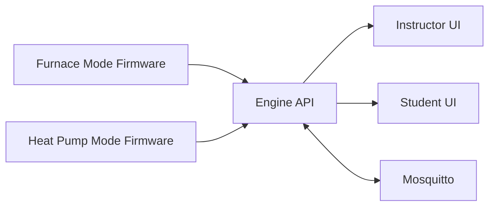

# HVAC Trainer Ver2.0

HVAC Trainer Ver2.0 is the integrated workspace for the Vesta trainer platform. It brings together ESP32 firmware, local engine services, instructor and student interfaces, and operational tooling for deployment and maintenance.

## Platform Scope

- Trainer support:
  - AC + gas furnace
  - Heat pump
- Unified firmware path for active hardware development
- Local Docker engine stack for API, MQTT, and web experiences
- Mobile app shell and next-generation workspace assets

## Repository Layout

```text
HVAC Trainer Ver2.0/
|- apps/
|  \- vesta-core-app/                   # Mobile app shell + Android project
|- docs/                                # General documentation
|- hvac-next-gen/                       # Next-generation app/service workspace
|- platform/
|  \- docker-engine/
|     |- backend/                       # FastAPI engine and simulation bridge
|     |- frontend/                      # Static frontend container assets
|     |- mosquitto/                     # MQTT broker config
|     |- web/                           # Instructor and student pages
|     \- docker-compose.yml
|- tools/                               # Flash, OTA, and utility scripts
\- trainers/
   |- ac-gas-furnace/
   |  \- docs/
   |- heat-pump/
   |  \- docs/
   \- unified-master/
      \- firmware/                     # Active PlatformIO project (ESP32-S3)
```

## Runtime Architecture



## Prerequisites

- Docker Desktop (or Docker Engine with Compose)
- Python 3.11+
- PlatformIO CLI or PlatformIO VS Code extension
- ESP32-S3 hardware and USB access for flashing

## Quick Start

### 1) Start local engine services

```bash
cd "platform/docker-engine"
docker compose up -d --build
```

### 2) Verify API health

```bash
curl http://localhost:8000/api/status
```

### 3) Open the instructor interface

- Instructor UI: http://localhost
- API status: http://localhost:8000/api/status

## Firmware Workflow

The active workflow uses the unified firmware project:

```bash
cd "trainers/unified-master/firmware"
pio run -e usb
```

For uploads, use the guarded scripts in tools to enforce correct trainer identity and target profile assignment.

## Development Standards

- Keep firmware, backend payloads, and UI fields synchronized when telemetry/control contracts change.
- Update docs in the same change when wiring, relay IDs, naming, or operational workflows are updated.
- Validate at least one end-to-end heartbeat and control loop after firmware-impacting changes.
- Treat generated state and build artifacts as local-only outputs.

## Troubleshooting

- Trainer not visible: verify engine target and inspect `GET /api/edges`.
- API online but no active trainer: verify edge selection and heartbeat freshness.
- Incorrect call-state behavior: validate thermostat inputs, debounce assumptions, and relay mapping.
- OTA or flash failures: use the scripts under tools and cross-check trainer docs.

## License

Proprietary project for Mitchell Media Vesta trainer platforms unless otherwise specified.
