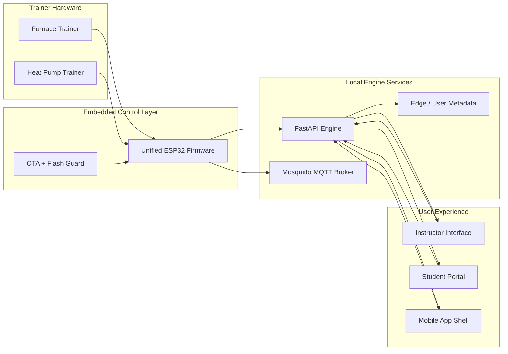
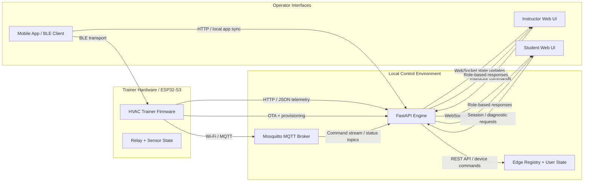

# Vexera Core Trainer Platform

## Executive Overview

The Vexera Core Trainer Platform is an integrated HVAC training and assessment system designed to combine physical trainer hardware, embedded control logic, instructor orchestration, student interaction, and operational tooling in a single unified architecture. The platform is designed for realistic HVAC system instruction, live equipment diagnostics, and controlled training scenarios across two primary trainer configurations: straight-ac gas furnace and heat pump systems.

This repository consolidates the complete development environment for the platform, including:

- Embedded ESP32-S3 trainer firmware for managed field equipment
- Local engine services for trainer discovery, telemetry orchestration, and control
- Instructor-facing operational dashboards and scenario controls
- Student-facing diagnostic and learning interfaces
- Mobile application shell for Android-based field and lab use
- Deployment and maintenance tooling for safe flashing, identity assignment, and OTA updates

The system is intended to support teaching environments in which students must diagnose, verify, and correct equipment behavior while instructors monitor performance and enforce operational scenarios in real time.

---

## Product Scope

The Vexera Core platform includes the following functional domains:

### 1. Physical Trainer Hardware

- Straight AC + gas furnace trainer configuration
- Heat pump trainer configuration
- Unified trainer firmware supporting both hardware identities through embedded boot-time detection
- Real relay and control states mapped to training operations and diagnostic tasks

### 2. Embedded Control Layer

- ESP32-S3 firmware stack for trainer behavior and telemetry transmission
- Hardware identity detection and trainer-number assignment
- OTA-capable firmware delivery pipeline
- Secure or guarded upload process to prevent accidental board mismatches
- Telemetry publication to the local engine via MQTT and REST-based state exchange

### 3. Local Engine and Control Services

- FastAPI service for engine state, authentication, edge registration, and device health
- MQTT broker for trainer communication and event propagation
- Dynamic edge discovery and trainer registry management
- Student and instructor role separation
- Scenario-driven state control for training and assessment outcomes

### 4. Instructor Experience

- Instructor login and controlled access
- Trainer selection, health visualization, and operational monitoring
- Real-time status for relay, sensor, and system state conditions
- Student scoring, fault activation, and scenario progression controls
- Administrative controls for edge management and system operations

### 5. Student Experience

- Student login flow with diagnostic and guided access
- Live trainer connection and session workflow
- System-level readouts and student-facing operational state
- Diagnostic engagement designed to reinforce HVAC reasoning and troubleshooting workflow
- Performance tracking tied to system outcomes and scenario tasks

### 6. Mobile and Native Experience

- Capacitor-based Android app shell for Vexera Core
- BLE-oriented trainer communication and local app integration
- Portable diagnostic access for lab and field workflows

---

## System Architecture


```mermaid
flowchart LR
    subgraph Trainers[Trainer Hardware]
        F[Furnace Trainer]
        H[Heat Pump Trainer]
    end

    subgraph Embedded[Embedded Control Layer]
        FW[Unified ESP32 Firmware]
        OTA[OTA + Flash Guard]
    end

    subgraph Services[Local Engine Services]
        API[FastAPI Engine]
        MQTT[Mosquitto MQTT Broker]
        DB[Edge / User Metadata]
    end

    subgraph Apps[User Experience]
        INST[Instructor Interface]
        STUD[Student Portal]
        MOB[Mobile App Shell]
    end

    F --> FW
    H --> FW
    FW --> MQTT
    FW --> API
    API --> DB
    API --> INST
    API --> STUD
    API --> MOB
    OTA --> FW
    INST --> API
    STUD --> API
    MOB --> API
```

---

## Communication Architecture and Protocol Map


```mermaid
flowchart LR
    subgraph Trainer[Trainer Hardware / ESP32-S3]
        T[HVAC Trainer Firmware]
        R[Relay + Sensor State]
    end

    subgraph Local[Local Control Environment]
        E[FastAPI Engine]
        M[Mosquitto MQTT Broker]
        D[Edge Registry + User State]
    end

    subgraph Client[Operator Interfaces]
        I[Instructor Web UI]
        S[Student Web UI]
        A[Mobile App / BLE Client]
    end

    T -->|Wi-Fi / MQTT| M
    T -->|HTTP / JSON telemetry| E
    T -->|OTA + provisioning| E

    M -->|Command stream / status topics| E
    E -->|WebSocket state updates| I
    E -->|WebSocket + HTTP state| S
    E -->|REST API / device commands| D

    A -->|BLE transport| T
    A -->|HTTP / local app sync| E

    I -->|Instructor commands| E
    S -->|Session / diagnostic requests| E
    E -->|Role-based responses| I
    E -->|Role-based responses| S
```

### Communication Protocol Summary

- MQTT: primary machine-to-machine communication channel for trainer telemetry, command topics, and event propagation between the ESP32 trainers and the local engine.
- HTTP / REST: used for engine health checks, edge management, authentication, and control requests from the instructor and student interfaces.
- WebSocket: used for live state updates and real-time dashboard behavior between the engine and browser-based operator clients.
- Wi-Fi / local network: the trainer communicates with the local engine over the network layer, including telemetry and OTA update traffic.
- BLE: used by the mobile app shell for short-range trainer discovery and communication when applicable to native device workflows.

### Data Flow Direction

1. Trainer hardware emits telemetry and status.
2. Embedded firmware transmits that signal over MQTT and network-based telemetry channels.
3. The engine normalizes and stores device state.
4. Instructor and student applications receive live updates through WebSocket and REST responses.
5. Operator commands are sent back to the engine and then routed to the corresponding trainer.

---

## Repository Structure

```text
HVAC Trainer Ver2.0/
├─ apps/
│  └─ vexera-core-app/                    # Capacitor-based Android/mobile app shell
├─ hvac-next-gen/                          # Next-generation monorepo workspace for app and service evolution
├─ platform/
│  └─ docker-engine/                      # Local engine stack, MQTT, instructor/student web assets
│     ├─ backend/                         # FastAPI control engine and simulation logic
│     ├─ frontend/                        # NGINX-based UI delivery layer
│     ├─ mosquitto/                        # MQTT broker configuration
│     ├─ web/
│     │  ├─ instructor/                   # Instructor dashboard and operator tooling
│     │  └─ student/                      # Student diagnostics and learning interface
│     └─ docker-compose.yml               # Local orchestration for API, frontend, and MQTT
├─ tools/                                  # Guarded flash and OTA deployment scripts
├─ trainers/
│  ├─ ac-gas-furnace/                     # Furnace trainer documentation and references
│  ├─ heat-pump/                          # Heat pump trainer documentation and references
│  └─ unified-master/
│     └─ firmware/                        # Active unified PlatformIO project for ESP32-S3 trainers
├─ README.md                               # System overview and operating context
├─ GPIO_MASTER_LAYOUT.txt                  # Shared GPIO layout and hardware reference material
└─ ...
```

---

## Core Platform Components

### Trainer Firmware

The active hardware workflow is centered on the unified firmware project located at:

- `trainers/unified-master/firmware`

This firmware is designed to support both trainer modes through a boot-time hardware identity selection mechanism. The system detects trainer profile state at startup and then applies the corresponding operating logic and device metadata.

Key characteristics:

- Unified codebase for furnace and heat pump hardware profiles
- Boot-time GPIO identity determination
- Trainer-instance identity labelling and registry-based naming
- OTA update support after provisioning
- Controlled upload path to avoid mismatched device assignment

### Vexera Core Engine

The local engine is implemented as a FastAPI application and is located under:

- `platform/docker-engine/backend/main.py`

This service provides:

- Device and edge discovery
- Trainer health tracking and telemetry parsing
- Student and instructor auth flows
- Role-based access control
- MQTT integration for trainer communication
- Edge selection and operational state management

### Instructor Interface

The instructor experience is served from the web application layer under:

- `platform/docker-engine/web/instructor/index.html`

This environment enables:

- Trainer viewing and selection
- Operational monitoring and state inspection
- Fault generation and scenario control
- Student performance tracking
- Instructor authentication and administrative actions

### Student Application

The student-facing application is served from:

- `platform/docker-engine/web/student/student.html`

This portal provides:

- Student login and session entry
- Trainer connection and diagnostics workflow
- Live state monitoring during training exercises
- Operational guidance tied to the physical trainer behavior
- Access to a controlled teaching environment consistent with system objectives

### Mobile App Shell

The Vexera Core mobile application shell is located here:

- `apps/vexera-core-app/`

This project is structured as a Capacitor application targeting Android and includes:

- Capacitor configuration and native Android packaging
- Web-based app shell for device interaction
- Bluetooth-related integration logic for trainer communication
- A portable front-end layer aligned with the broader Vexera Core product concept

---

## Operational Model

The platform operates as a closed-loop technical training environment:

1. Physical trainer hardware executes HVAC logic and emits operational state.
2. Embedded firmware publishes telemetry and accepts commands.
3. Local engine services normalize and manage these state updates.
4. Instructor interfaces supervise session conditions and diagnostics.
5. Student interfaces engage with system behavior and learning objectives.
6. Mobile app shell extends access for portable device-based use cases.

This closed-loop model supports both practical instruction and reproducible technical evaluation.

---

## Local Deployment

### Prerequisites

- Docker Desktop or Docker Engine with Compose support
- Python 3.11+
- PlatformIO CLI or equivalent firmware tooling
- ESP32-S3 hardware for trainer provisioning and firmware flashing

### Start the local engine stack

```bash
cd "platform/docker-engine"
docker compose up -d --build
```

### Verify service health

```bash
curl http://localhost:8000/api/status
```

### Default local web endpoints

- Instructor UI: `http://localhost` or the configured frontend host
- Student UI: `http://localhost/student`
- Engine API: `http://localhost:8000/api/status`

---

## Firmware Workflow

The active firmware workflow uses the unified master project:

```bash
cd "trainers/unified-master/firmware"
pio run -e usb
```

For operational deployments, the repository includes guarded scripts under `tools/` to ensure the correct trainer identity, target type, and board assignment are preserved during flashing and OTA updates.

This includes:

- Trainer target validation (`furnace` or `heatpump`)
- Board identity checks against expected MAC records
- Trainer-number assignment and registry persistence
- Safe OTA workflows for registered devices
- Reduced risk of incorrect trainer programming in live environments

---

## Security and Access Model

The platform includes role-based access between instructor and student workflows. Operational and administrative access is intentionally restricted to authorized contexts, while the local engine maintains user metadata and trainer state.

The current implementation includes:

- Instructor/admin roles for operational control
- Student role for guided diagnostic access
- Local credential management for training sessions
- Device registry and edge selection flow for system validity

---

## Training and System Use Cases

The platform is intended for use in technical HVAC education and training programs, including:

- HVAC system troubleshooting
- Control logic interpretation
- Relay and equipment state validation
- Diagnosis of operational faults and abnormal conditions
- Instructor-led scenario progression and performance evaluation
- Student self-guided technical reasoning and diagnostic practice

---

## Development Standards

The repository is structured to maintain alignment between the following domains:

- Embedded firmware logic
- Device identity and telemetry behavior
- Engine-side state management
- Instructor operation and scenario flow
- Student diagnostic experience
- Mobile application integration

Recommended practice for extension of the platform:

- Keep firmware, API payloads, and UI field contracts synchronized
- Update documentation when behavior, device identity, or training scenarios change
- Validate end-to-end system behavior for firmware and edge-impacting updates
- Treat generated data and local build artifacts as non-source outputs

---

## Troubleshooting and Maintenance

Typical operational checks include:

- Confirm the trainer is online and visible via the edge registry
- Validate the selected device and heartbeat freshness in the engine state
- Inspect trainer identity and target assignment before firmware upload
- Use the guarded OTA scripts to avoid board mismatches
- Confirm MQTT and API health before diagnostic workflow validation

---

## Intellectual Property and Proprietary Status

This project represents a proprietary Vexera Core trainer platform and associated training architecture. The system, methods, and operational workflow described herein are intended for proprietary internal use and controlled deployment unless otherwise explicitly authorized in writing.

All firmware, software, operational documentation, and training system interfaces within this repository are considered part of the Vexera Core platform and may be subject to licensing, confidentiality, and controlled distribution restrictions as defined by the governing organization.

Proprietary project for Mitchell HVAC trainer platforms unless otherwise specified.

---

## Summary

The Vexera Core Trainer Platform is a complete HVAC training and diagnostics system that unifies hardware, software, and instructional workflows into a single operable architecture. It includes the physical trainer ecosystem, the embedded control layer, the local engine, the instructor control portal, the student application, and mobile integration support.

This repository serves as the technical foundation for the platform and provides the operational and development environment necessary to design, deploy, and maintain advanced HVAC training systems in a structured and professional manner.
